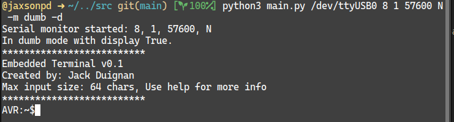

# Better Serial

A serial terminal that isn't rubbish. This project was inspired by the
sorry state of the serial monitor offering available especially on windows.
Its key features are listed below.

### Implemented:
- Easy sending of command chars in a way that can be viewed.
- Automatic open when device is detected.
- No separate send box just acts like a terminal.
- Ability to display non-printable ascii chars.

### To be implemented:
- Auto resume on device reconnection (without application restart).
- Listing of available serial ports.
- Configurable UI
- End of packet identifier (to force a new line on chars other than `\n`)
- All numerical output (print out all received data as int or hex etc.)

## Screenshots

**The terminal in dumb mode:**


## Use

There are two modes for this application. These are detailed in the following 
sections. The command line arguments for the application can be found by
running with the `-h` flag.

### Dumb Terminal

In this mode the serial monitor acts like a dumb terminal sending chars when
pressed and writing chars when received. In this mode no special chars can be
sent to the device however the special char display switch for incoming data 
does work.

To exit this mode use `<alt-c>` which will terminate the send and receive 
threads.

### Local Edit/CMD sender

In this mode the serial monitor has local line edit and allows the sending of 
special chars using the `\xFF` or `\o888` methods (where \ is a special char 
and must be escaped). The terminal reads back as normal printing chars when they 
are received.

To exit this mode use `<ctrl-c><ctrl-c>` to exit both the send and receive 
threads.

## Installation

### Manual run
Clone the git repository and then run:

```bash
python3 ./src/main.py
```

This applications requirements are outlined in [requirements.txt](./requirements.txt). These can be installed using:

```bash
pip3 install -r requirements.txt
```


### Pre-compiled

Pre-compiled versions of this application can be found in the releases tab. 
These have been created using `pyinstaller` and may or may not work, I make
no promises.


## Program overview

This application uses multithreading to realise simultaneous send and receive.
This allows the use of blocking read and writes simplify the code. There are 
two threads the first handles receive and print to the terminal `com_rx.py` and 
the second handles getting user input and sending to the device `com_tx.py`.

This program uses two settings files. The first (`default-settings.json`)
handles the default values for the program while the second (`settings.json`)
contains the settings for the current session (this should not be edited as
the program reads directly from it).

## To Do

### Admin/Tidy
- [ ] Move threads to classes

### Features
- [ ] Add packet end identifier
- [ ] Ability to list available serial ports
- [ ] Configuration file
- [ ] Auto Resume
- [ ] Numerical output

### Bug Fix
- [ ] Allow for one sequence exit in all cases